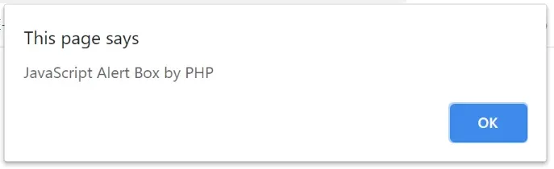
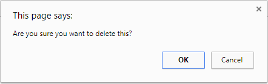
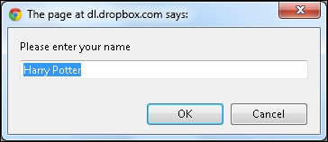

There are various types of alerts that the developers can implement on web applications. Each of these alerts/popups needs different kinds of actions to handle these alerts. 

Different types are alert boxes are,

### 1. Simple Alert

These alerts are just informational alerts and have an OK button on them. Users can click on the OK button after reading the message displayed on the alert box. A simple alert box looks like below:



### 2. Confirmation Alert

These alerts get some confirmation from the user in the form of accepting or dismissing the message box. Users can only read the message and provide the inputs by pressing the OK/Cancel button.



### 3. Prompt Alert
In Prompt alerts, some input requirement is there from the user in the form of text needs to enter in the alert box, where the user can enter his/her username and press the OK button or Cancel the alert box without entering any details.




## Handle Alert/Popups
WebDriver always has the focus on the main browser window and will run all the commands on the main browser window only. But, whenever an alert/popup appears, it opens up a new window. So, for handling the Alerts using Selenium WebDriver, the focus need to be shifted to the child windows opened by the Alerts. To switch the control from the parent window to the Alert window.

``` 
Alert alert = driver.switchTo( ).alert( );
```

## Alert methods

### accept
This method clicks on the 'OK' button of the alert box.
```
driver.switchTo( ).alert( ).accept();
```
### dismiss

We use this method when the 'Cancel' button clicks in the alert box.
```
driver.switchTo( ).alert( ).dismiss();
```
### getText
This method captures the message from the alert box.
```
driver.switchTo().alert().getText();
```
### sendKeys
This method sends data to the alert box.
```
driver.switchTo().alert().sendKeys("text");
```